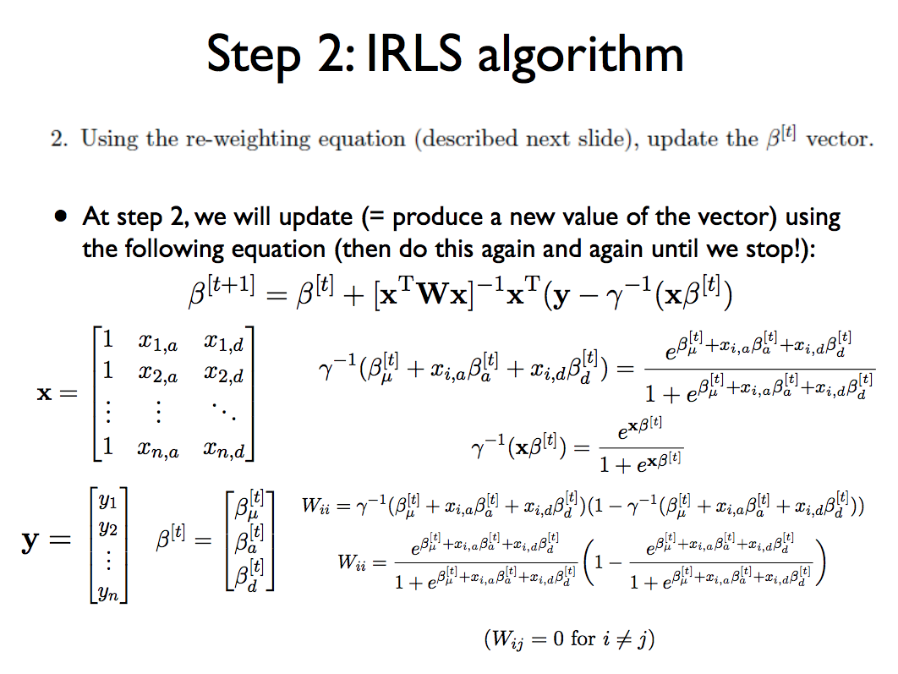
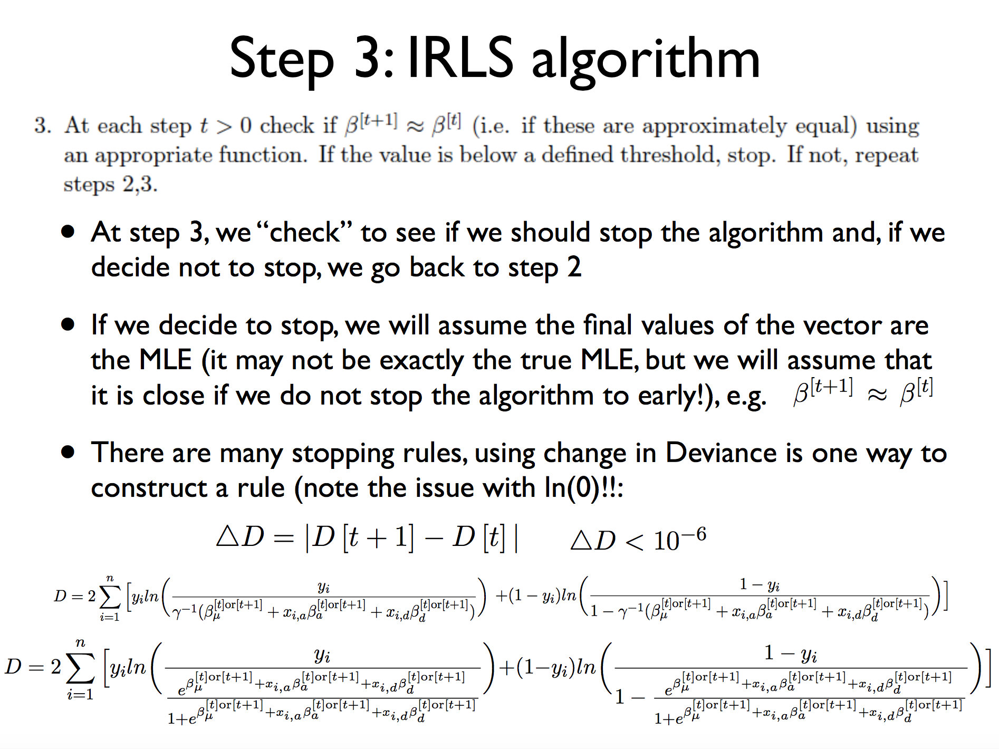

```{r setup, include=FALSE}
library(knitr)

library(knitr)
hook_output = knit_hooks$get('source')  #this is the output for code

knit_hooks$set(source = function(x, options) {
  # use if the output is PDF and you set an option linewidth to e.g. 70
  # in the chunk options
  if (!is.null(n <- options$linewidth) & knitr::is_latex_output()) {
    x <- strwrap(x, width = n, exdent = 4)
  }
  hook_output(x, options)
})

library(ggplot2)
library(MASS)
```


## 0. Overview


1. Logistic Regression

2. IRLS Algorithm

3. Example Calculating pvals

4. Making the IRLS code more efficient

\hspace*{0.5in} 4.1 Recursion

\hspace*{0.5in} 4.2 Apply function

5. Adding Covariates

6. Linear Mixed Model vs. Mixed Model

\hspace*{0.5in} 6.2 Motivation


## 1. Logistic Regression

Last week we went over the theory of logistic regrssion.  A short summary of which is that logistic regression transform our simple linear model with the logit function, which is of the form shown below.

$$F(x)=\frac{1}{1+e^{-(\beta_0+\beta_1x)}}$$


A simple visualization in R might give us a better idea of how the data is transformed. Basically, logistic regression confines the original dependent values within the range of 0 and 1. This confinement enhances the ability to predict binary data.

```{r, echo = TRUE, fig.show='hold',  fig.width=8, fig.height=4, fig.align='center' }
x <- seq(-1,1,by = 0.1)
y_linear <- x * 4
y_logistic <- 1 / ( 1 + exp(-y_linear))

par(mfrow = c(1,2))
plot(x, y_linear, main = "Linear function", type = "l")
abline(h = 0, col = "red", lty = 2)
abline(h = 1, col = "red", lty = 2) 
plot(x,y_logistic, main = "logistic regression curve",
     type ="l", ylim = c(-0.5,1.5))
abline(h = 0, col = "red", lty = 2)
abline(h = 1, col = "red", lty = 2)
```

However, this confinement comes at a cost. The logit function can not be easily differentiated and solved following maximum likelihood estimation.  Instead we will have to guess the best answer, check how good this answer is, and repeat.  This process is directly related to the process of finding the zero of a line using Newton's Method.


## 2. IRLS Algoritm

Last week you were left with the exercise of filling in the functions below.  Hopefully you made some progress, but in any event we will now go over how to translate the equations in lecture into a filled out algorithm.  Let's start with where we left off:

```{r, comment = NA, echo = TRUE,eval = FALSE, fig.align='center', fig.width=7,fig.height=4}
W_calc <- function(gamma_inv){
     
    return(W)
}


beta_update <- function(X_mx, W, Y, gamma_inv, beta){
	return(beta_up)
}


gamma_inv_calc <- function(X_mx, beta_t){
    return(gamma_inv)
}


dev_calc <- function(Y, gamma_inv){
    return(deviance)
}


loglik_calc <- function(Y, gamma_inv){
    return(loglik)
}


logistic.IRLS<- function(Xa,Xd,Y = Y, beta.initial.vec = 
                          c(0,0,0), d.stop.th = 1e-6, it.max = 100) {
    
    # Create Initial values
    
  
    # Start of optimization loop
    for(i in 1:it.max) {
         
        # calculate W
      
        # update beta
      
        # update gamma_inv
      
        # calculate deviation
      
        # check if deviation is smaller than threshold
        if() {
            cat("Convergence at iteration:", i, "at threshold:", d.stop.th, "\n")
            logl<-# Log likelihood goes here
            return(list(beta_t,logl)) # return a list that has beta.t and logl saved
        }   
    }
  
    # In case the algorithm did not coverge
    cat("Convergence not reached after iteration:", i, "at threshold:", d.stop.th, "\n")
    return(list(beta_t= c(NA,NA,NA),logl=NA)) # return NA values 
}

G <- dim(Xa)[2]
logl <- vector(length = G)
for(j in 1:G){
  result.list <- call our function
  logl<- # How do we extract an element from a list? might want to use [[]]
}
# Calculate the log likelihood for the NULL using IRLS
logl_H0 <- logistic.IRLS(Y=Y, Xa= NULL, Xd=NULL, beta.initial.vec = c(0))[[2]]
LRT<-2*logl-2*logl_H0 #likelihood ratio test statistic
pval <- # chi squared test with the following parameters (LRT, 2, lower.tail = F)
  
# Plot manhattan plot with cut off line  
plot(-log10(pval))
abline(-log10(0.05/300),0,col="red")
```

Almost all of the information we need is within a single slide from Lecture 18:

```{r, out.width = "400px", fig.show='hold',  fig.width=14, fig.height=14, fig.align='center'}

```

From this slide let's begin with the most basic building block, which is the gamma-inverse equation.  We can tell this is the building block as its value shows up in some of the other equations, such as beta update and W.  We can see in the slide there are two gamma-inverse equations, the shorter matrix formatted version will be easier to convert into code.  We can see two inputs into this equation X and beta, therefore our function will have two inputs as well.  There is clearly one output from this equation as well, which is the value we will be returning from our function.  After putting everything together we get the following:

```{r}
gamma_inv_calc <- function(X_mx, beta_t){
    #initialize gamma
    # K is the part which goes into the exponent
    K <- X_mx %*% beta_t
    gamma_inv <- exp(K)/(1+exp(K))
    return(gamma_inv)
}
```

Building up in complexity we can see that the equation for W only requires the gamma-inverse product.  While there may seem to be much more going on, by looking closely at the matrix version of the equation there are two gamma-inverses which itself has the same inputs as we just calculated.  Therefore, we can substitute this confusing gamma-inverse equation with the output we already made.

```{r}
W_calc <- function(gamma_inv){
		W <- diag(as.vector(gamma_inv * (1- gamma_inv)))
    return(W)
}
```

Notice that in the equation we are only looking at the ii'th element, which in code means we are only looking at the diagonal of a matrix. Now that we have both W and gamma-inv we can move onto the most important function, which is the beta update.  Note that this equation is made up of matrix elements, so our operators must reflect that.

```{r}
beta_update <- function(X_mx, W, Y, gamma_inv, beta){
  #print(dim(X_mx))
  #print(dim(W))
  beta_up <- beta + ginv(t(X_mx)%*%W%*%X_mx)%*%t(X_mx)%*%(Y-gamma_inv)
	return(beta_up)
}
```

We can see there are additional inputs to this function other than just gamma-inv and W, specifically X_mx, Y and beta.  Each of these are already given and therefore do not need to be calculated.

The last two elements are the deviance and the likelihood.  These equation do not directly effect the updating of beta, but are rather checks on the process to determine whether the algorithm needs to keep running. The equations we use to check the process are copied below, again from Lecture 18 slides

```{r, out.width = "400px", fig.show='hold',  fig.width=14, fig.height=14, fig.align='center'}

```

Their functions are provided below:

```{r}
dev_calc <- function(Y, gamma_inv){
    deviance <- 2*( sum(Y[Y==1]*log(Y[Y==1]/gamma_inv[Y==1])) + sum((1-Y[Y==0])*log((1-Y[Y==0])/(1-gamma_inv[Y==0]))) )  
    return(deviance)
}

loglik_calc <- function(Y, gamma_inv){
    loglik <- sum(Y*log(gamma_inv)+(1-Y)*log(1-gamma_inv))
    return(loglik)
}
```

Now that all of the components are assembled we can begin looking into the actual processing of the algorithm.  As stated earlier, the IRLS follows a guess-and-check process.  The three main steps in this algorithm are:

  1. Initilization
  2. Looping to update beta
  3. Checking if we're done
  
We can even break the IRLS function down into these three steps, first is initialization:

```{r, eval=FALSE}
#Create the X matrix
X_mx <- cbind(rep(1,nrow(Y)), Xa, Xd)

#initialize the beta parameter vector at t=0
beta_t <- c(0,0,0)

# initialize deviance at d[t]
dt <- 0

#initialize gamma
gamma_inv <- gamma_inv_calc(X_mx, beta_t)
```

Second is looping to update the beta:

```{r, eval=FALSE}
W <- W_calc(gamma_inv)

beta_t <- beta_update(X_mx, W, Y, gamma_inv, beta_t)
```

Third is checking if we're done:
```{r, eval=FALSE}
#need to update gamma_inv for the deviance
gamma_inv <- gamma_inv_calc(X_mx, beta_t)

#calculate new deviance
dt <- dev_calc(Y, gamma_inv)
absD <- abs(dt - dpt1)
```

Wrapping everything up together we have:

```{r}
## Note that I changed the inputs of the function from last lab. We now have X_mx as an input rather than each Xa and Xd matrix
logistic.IRLS<- function(X_mx,Y =Y, beta.initial.vec = c(0,0,0),
                         d.stop.th = 1e-6, it.max = 100) {
  #check this matrix:
	#initialize the beta parameter vector at t=0
	beta_t <- beta.initial.vec
  
  # initialize deviance at d[t]
	dt <- 0
	
	#initialize gamma
  # K is the part which goes into the exponent
  gamma_inv <- gamma_inv_calc(X_mx, beta_t)
	
	for(i in 1:it.max) {
		dpt1 <- dt #store previous deviance
		
    # create empty matrix W
		W <- W_calc(gamma_inv)
    
		beta_t <- beta_update(X_mx, W, Y, gamma_inv, beta_t)
		
		#update gamma since it's a function of beta
		
		gamma_inv <- gamma_inv_calc(X_mx, beta_t)
		#calculate new deviance
		dt <- dev_calc(Y, gamma_inv)
		
		absD <- abs(dt - dpt1)
		
		if(absD < d.stop.th) {
			#cat("Convergence at iteration:", i, "at threshold:", d.stop.th, "\n")
			logl <- loglik_calc(Y, gamma_inv)
			return(list(beta_t,logl))
		}	
	}
	#cat("Convergence not reached after iteration:", i, "at threshold:", d.stop.th, "\n")
	return(list(beta_t= c(NA,NA,NA),logl=NA))
}
```

## 3. Example Calculating pvals

This function differs from previous GWAS gunctions as it returns the betas and log-likelihoods, not the p-values.  To get the p-values we will need to compare our hypothesis to a null hypothesis.  To see how this process works let's start pulling up some data.

```{r}
Y <- read.table("phenotypes-logistic.tsv", header = T,stringsAsFactors = F)
geno <- read.table("genotypes-logistic.tsv", header = T)
```

Before doing anything else, we should check whether the phenotype should be analyzed using linear or logistic regrsesion.  The choice is made by the phenotype's distribution, if it is binary then we use logistic and if normal then we use linear.

```{r}
hist(Y[,1])
```

*Question*
Why would linear regression "not work"?

While not perfectly binary we can clearly see two clusters around 0 and 1.  This appears far more binary than normal, so logistic regression is likely the best option.  We will now convert it into traditional Xa and Xd coding:

```{r}
Y <- as.matrix(Y)
colnames(Y) <- NULL
Y[Y[,1] < 0.5, 1] <- 0
Y[Y[,1] > 0.5, 1] <- 1
xa_matrix <- as.matrix(geno)
xd_matrix <- 1 - 2*abs(xa_matrix)
```

For simplicity let's only look at one variant, which will be the first column of Xa and Xd.  We can use our IRLS function to get the corresponding alternative hypothesis:

```{r}
X_mx <- cbind(1, xa_matrix[,1], xd_matrix[,1])
h1_List <- logistic.IRLS(Y=Y, X_mx=X_mx)
cat("The betas are ",h1_List[[1]], "and the log likelihood is ", h1_List[[2]])
```

For the null hypothesis we change the Xa and Xd so that they represent no genetic information.

```{r}
X_mx <- cbind(1, rep(0,nrow(Y)), rep(0,nrow(Y)))
h0_List <- logistic.IRLS(Y=Y, X_mx=X_mx)
```

Similar as with our processing of covariates, we now form a likelihood test statistic and use it within the chi-square distribution to calculate a p-value.  Remember that our IRLS function outputs a list of the betas and the likelihood.  The likelihood ratio test statistic is simply just a comparison of our two individual likelihoods.

```{r}
LRT<-2*h1_List[[2]]-2*h0_List[[2]] #likelihood ratio test statistic
pval <- pchisq(LRT, 2, lower.tail = F)
cat("The pval is", pval)
```


To generalize this calculation for other polymorphisms, we can wrap up the above calculations for the pvalue into the function below:

```{r}
logistic.IRLS.pval <- function( Xa, Xd,Y, beta.initial.vec = c(0,0,0),
                                d.stop.th = 1e-6, it.max = 100) {
  
  #Initialize
  beta_t <- beta.initial.vec
	dt <- 0
	
  X_mx <- cbind(rep(1,nrow(Y)), Xa, Xd)
  gamma_inv <- gamma_inv_calc(X_mx, beta_t)
	h1 <- logistic.IRLS( X_mx, Y=Y, beta.initial.vec = c(0,0,0),
	                     d.stop.th = 1e-6, it.max = 100)
	
	X_mx <- cbind(rep(1,nrow(Y)), rep(0,nrow(Y)),rep(0,nrow(Y)))
  gamma_inv <- gamma_inv_calc(X_mx, beta_t)
	h0 <- logistic.IRLS( X_mx, Y=Y, beta_t, d.stop.th = 1e-6, it.max = 100)
  
	LRT <- 2*h1[[2]]-2*h0[[2]] #likelihood ratio test statistic
  pval <- pchisq(LRT, 2, lower.tail = F)
	return(pval)
}
```


## 4. Making the IRLS code more efficient

Hopefully the process thus far was understandable, but there are a few things we can do to ensure the algorithm runs faster and with fewer errors.


### 4.1 Recursion

The first change we can make is to introduce recursion.  The basic idea behind recursion is to replace loops with spiraling function calls.  Recursion is an important concept in computer science as they are less prone to errors and are proven to be faster than loops.

Below is an example of recursive programming calculating the Fibonacci Sequence:

```{r}
recurse_fibonacci <- function(n) {
  if(n == 0) {
    return(n)
  } else if (n==1) {
    return(1)
  } else {  
    return(recurse_fibonacci(n-1) + recurse_fibonacci(n-2))
  }
}

recurse_fibonacci(4)
#0 + 1 + 1 + 2 + 3 + 5 + 8 + ...
```

We can see here that the basic form of recursion is for a function to call itself within the return statement.  With this pattern we can implement recursion into our IRLS algorithm:

```{r}
logistic.IRLS.recursive <- function(Y, X_mx, beta_t, dpt1, gamma_inv,
                                    iter, d.stop.th = 1e-6, it.max = 100){
    # create empty matrix W
		W <- W_calc(gamma_inv)
    
		beta_t <- beta_update(X_mx, W, Y, gamma_inv, beta_t)
		
		#update gamma since it's a function of beta
		gamma_inv <- gamma_inv_calc(X_mx, beta_t)
		
		#calculate new deviance
		dt <- dev_calc(Y, gamma_inv)
		absD <- abs(dt - dpt1)
		
		if(absD < d.stop.th | iter > it.max) {
			#cat("Convergence at iteration:", i, "at threshold:", d.stop.th, "\n")
			logl <- loglik_calc(Y, gamma_inv)
			return(list(beta_t,logl))
		}	else {
		  return(logistic.IRLS.recursive(Y, X_mx, beta_t, dt, gamma_inv, iter+1,
		                                 d.stop.th = 1e-6, it.max = 100))
		}
}
```

Again this looks nice, but does it work?  To test I will now make a function that includes the pvalue calculation:

```{r}
logistic.IRLS.pval.recursive <- function(Xa,Xd,Y, beta.initial.vec = c(0,0,0),
                                         d.stop.th = 1e-6, it.max = 100) {
  #Initialize
  beta_t <- beta.initial.vec
	dt <- 0
	
  X_mx <- cbind(rep(1,nrow(Y)), Xa, Xd)
  gamma_inv <- gamma_inv_calc(X_mx, beta_t)
	h1 <- logistic.IRLS.recursive(Y, X_mx, beta_t, dt, gamma_inv,
	                              1, d.stop.th = 1e-6, it.max = 100)
	
	X_mx <- cbind(rep(1,nrow(Y)), rep(0,nrow(Y)),rep(0,nrow(Y)))
  gamma_inv <- gamma_inv_calc(X_mx, beta_t)
	h0 <- logistic.IRLS.recursive(Y, X_mx, beta_t, dt, gamma_inv,
	                              1, d.stop.th = 1e-6, it.max = 100)

	LRT <- 2*h1[[2]]-2*h0[[2]] #likelihood ratio test statistic
  pval <- pchisq(LRT, 2, lower.tail = F)
	return(pval)
}
```

Now we can test it out:

```{r}
pval <- logistic.IRLS.pval( Xa = xa_matrix[,1], Xd = xd_matrix[,1], Y)
cat("The pval is", pval)
```


This is the exact same p-value as before, which is great!  Now we can calculate the p-values for all of the variants. 

To confirm that besides getting the same pvalue, the recursive method is faster than the looping method, we can time the calculation of all the pvalues using each method:

```{r}
# Get all pvals using the Looping method
startLoop <- proc.time()
allPvals.loop <- rep(0,ncol(xa_matrix))
for(i in 1:ncol(xa_matrix)){
 allPvals.loop[i] <- logistic.IRLS.pval(Xa = xa_matrix[,i],
                                        Xd = xd_matrix[,i], Y)
}
endLoop <- proc.time() - startLoop

# Get all pvals using the Recursive method
startRec <- proc.time()
allPvals.rec <- rep(0,ncol(xa_matrix))
for(i in 1:ncol(xa_matrix)){
 allPvals.rec[i] <- logistic.IRLS.pval.recursive(
  Xa = xa_matrix[,i], Xd = xd_matrix[,i], Y)
}
endRec <- proc.time() - startRec


cat("The recursive time is ",endRec[1]," and the loop time is ", endLoop[1])
```


### 4.2 Apply Function

Besides using the for loop, we can alternatively use the apply function to further speed up our code.  Let's compare both:

```{r}
# Think about dimensions of each element here. Break it down and draw it out, whatever you can to visualize
allPvals <- apply(rbind(xa_matrix,xd_matrix), 2, 
                  function(x) logistic.IRLS.pval(Xa=x[1:nrow(xa_matrix)], Xd=x[(nrow(xa_matrix)+1):length(x)], Y))
```

*Question*
What other apply family function could I apply?

They give the same answer, that's nice. I've told you in the past that apply functions are faster than for loops, but is that really true?  We can now test this claim using the proc.time() function. While there are more advanced methods, this function should give the basic timing we are looking for:

```{r}
startLoop <- proc.time()
allPvals <- rep(0,ncol(xa_matrix))
for(i in 1:ncol(xa_matrix)){
 allPvals[i] <- logistic.IRLS.pval(Xa = xa_matrix[,i], Xd = xd_matrix[,i], Y)
}
endLoop <- proc.time() - startLoop

startApply <- proc.time()
allPvals <- apply(rbind(xa_matrix,xd_matrix), 2,
                  function(x) logistic.IRLS.pval(Xa=x[1:nrow(xa_matrix)], Xd=x[(nrow(xa_matrix)+1):length(x)], Y))
endApply <- proc.time() - startApply

cat("The loop time is ",endLoop[1]," and the apply time is ", endApply[1])
```

Intersting, it appears that in this case the apply function is slightly slower than or about comparable to the for loop.  This may be because we are only testing a relatively small number of variants.  Typically when the time is less than a second the computational time predictions are rather incacurate.  

It is also important to note that proc.time() actually contains 3 times: user, system and elapsed.  The user time is time charged for instructions, the system time is time charged for CPU calls, and elapsed time is the sum of the prior two.  With this framework we could also test whether the recursive or loop functions are faster.


## 5. Adding Covariates

It is very simple to add covariates to the IRLS algorithm. Simply append the covariates to your input X matrix of independent variables when you calculate MLE betas and compare the likelihoods of the null hypothesis likelihoods (with 1 and the covariates) to the likelihoods of the alternative (with 1 and the covariates along with the genotype info).


```{r, eval=FALSE}
X_mx_forH0 <- cbind( 1, Covariates...)
X_mx_forH1 <- cbind( 1, Xa, Xd, Covariates...)
# Then call IRLS and then calculate LRT and then pval
```


