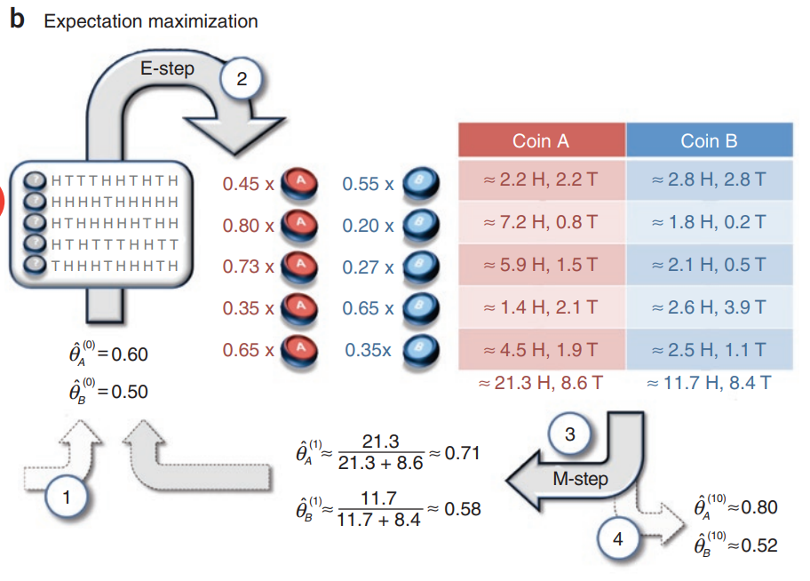
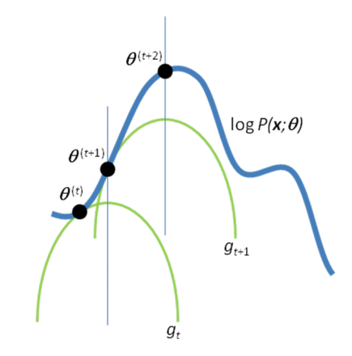
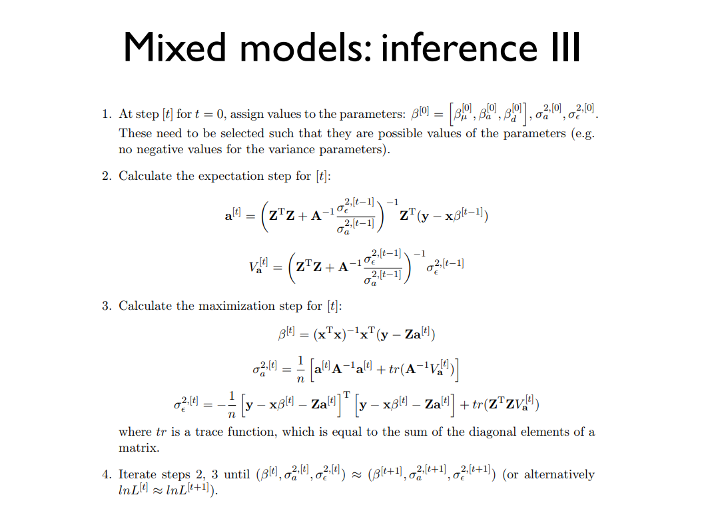

```{r}
library(MASS)
library(ggplot2)
```

--------------------------------------------------------------------------
### 1. Linear Mixed Model vs. Mixed Model

Throughout the course thus far we have used linear models to investigate how the genotype may interact with a phenotype.  This is a simple model in which any change within the X variable will directly change the y variable, in proportion to the value of beta.  

$$ y =  X\beta + \epsilon $$

Understanding that we cannot capture all of the phenotypic variance through the genetic values alone, an error term is added to the end.  This error value, in the linear setting, is assumed to be normally distributed.

$$ \epsilon \sim N(0, \sigma_e^2 \mathbf{I}) $$

The mixed model looks similar to the linear model, the largest change is the addition of an association term:

$$y = X\beta + Za + \epsilon$$

This new term is of an entirely different class than before.  The first Xbeta are called fixed effects and the Za are the random effects.  We want the genetic effects to be fixed, that way we can test for it in any individual and get the same result.  The term random effects may seem like an odd name, but they are analogous to a random variable in that any one sample from these effects can be pooled with another sample.  A better definition is:

"Effects are fixed if they are interesting in themselves or random if there is interest in the underlying population. Searle, Casella, and McCulloch (1992, Section 1.4)"

There are many other definitions however, so don't get hung up on the terminology.  What makes these expanded variable become clear is the distribution they are assumed to be based on:

$$ \epsilon \sim multiN(0, \mathbf{I}\sigma_e^2) \\ a \sim multiN(0,A\sigma^2_a)$$

The epsilon term remains the same as before.  The a term is based on the covariance of a matrix called A, more commonly termed the genetic relationship matrix.  Therefore the values of a are a measure of how well the samples are related.  We also allow for multi-normal distribution, or a mixture of normal distributions, signifying there may be multiple distinct populations within our sample.  The last new term is Z, or the incidence of the random effects.  By following the matrix multiplication we can see that by including off-diangonal terms within this matrix we are linking two or more people together.  Therefore, the Z matrix can effectively be though of as our expected population structure.  The easiest and most common option is to leave this matrix as the identity matrix.

More information on mixed models can be found in this presentation: http://nitro.biosci.arizona.edu/workshops/Synbreed2013/Lectures/Lecture28.pdf.  Or a really great new publication which compares animal and human genetics: http://www.genetics.org/content/genetics/211/4/1131.full.pdf.

### 2. Motivation

From first comleting the simple or univariate regression in Lab 7 we have learned that there are certain factors that may confound the relationship between X and y.  The two largest are population structure and linkage disequilirbium.  Explanations for how they may cause confounding and how mixed models alleviate their problems are as follows:


We have dealt with population structure by including principal components as covariates.  While this method works well, we are implicitly throwing away any knowledge about complex population interactions.  For instance if person A has variant 1 and is very tall we may say that variant 1 causes height.  By adding a covariate we may see that people in person's A population structure tend to be slightly taller, but they have a variety of variants.  However, by looking at person B who is related to person A we find that variant -1 also causes height.  These contradictory results would lead to the conclusion of no association.  By using person B, we gain more specific population information and variant-fine clarity of how population structure might be confounding.


Linkage disequilibrium has been an after though in linear regression.  When looking at Manhattan Plots we condense significant variants into peaks or loci rather than single points of importance.  While linkage disequilibrium is not explicitly considered within mixed models, we are implicitly taking it into account since multiple variants are being regressed simultaneously against the same phenotype.  For example, we can consider 3 variants which are highly correlated within all of the samples.  When estimating the association between each variant and the phenotypes the iterative mixed model process would first find the first variant to be highly significant.  But on the next iteration the second variant is the significant one, and the significance of the fist becomes slightly diminished.  This process continues, shrinking the association between variaints in high LD.  

--------------------------------------------------------------------------
### 3. EM Algorithm - Theory

The basics of the EM algorithm are directly in the name, we expect and then maximize.  This two part approach is the exact same process we have seen in the Newton's Method algorithm, and put into practice within the IRLS algorithm.  The conventional example of the EM algorithm is determining if various points on a plane are clustered together.  While this may sound very different from our genetic association problem, it is in fact the same problem.  In forming clusters we are trying to find a mixture of normal distributions that fit the data, in the mixed model associations we are clustering the individuals into different population structures (and then measuring the associations).

The fancy word for a sample's unknown group is a latent variable.  For example for person A we want to know the latent or unknown population anestry.  A great description of this process is shown below, where we are trying to determine if a set of coin flips came from the red or blue coin.  We know that the red and blue coin have different biases, but we do not know what those biases are.  So we expect a bias, check how well the bias fits the data, and then adjust accordingly.

```{r, out.width = "400px", fig.show='hold',  fig.width=14, fig.height=14, fig.align='center'}

```

The full article in which this figure came from is: http://ai.stanford.edu/~chuongdo/papers/em_tutorial.pdf

A more general and rigerous approach is show in the image below.  In all implementations of the EM algorithm we begin in the expectation step by creating a function that approximates the true data.  This function assures convergence as it is a lower bound on the objective function, or true data.  This function can be visualized within the clustering problem as the intermediary probability density function.  In the maximization step, the maximum of this approximated function is taken.  This process is then repeated as this guess produces a new function that is guaranteed to be better than the old function.

```{r, out.width = "400px", fig.show='hold',  fig.width=14, fig.height=14, fig.align='center'}

```

### 3. EM Algorithm - Practice

Following the slides, the EM algorithm can be laid out in two steps.  The first step is to calculate a and V, the second step is to calculate beta, sigma of a and sigma of epsilon.  The V variable is a sum of both epsilon and a, in this way we are first expecting values that are implicity considered in the model and then secondly we are using these values to maximize the variables that are directly used to form the effects.

The technical aspect of the EM algorithm is beyond the scope of this course, so in this exercise we are going to focus on the important skill of converting the equations in the notes into working code.  We begin by laying out the skeleton the code will fit within:

```{r, eval = FALSE}
EM_algorithm = function(Y, X_j, A, max.iter = 100) {
  #initiate values
  
  while (iter < max.iter) {
    #Expect
    
    #Maximize
    
    if (log_L[iter] - log_L[iter - 1] < 1e-05) { break }
    iter = iter + 1
  }
  return(list(beta = beta, sigma_sq_a = sigma_sq_a, sigma_sq_e = sigma_sq_e, log_L = log_L[iter - 1]))
}
```

Beginning from the top we can break down "initiate values" into three different parts.  First we need to declare our guesses to the values that will later be maximized, as they are needed for the inital step of expectation.  Secondly, we can write down some "shortcuts", or name variables that we will use often.  This practice of storing calculated values that are used many times later is a common practice in coding as it speeds up execution times.  Thirdly we need to compute the likelihood value, which will be used after the first iteration has been completed to determine whether the algorithm is done running.

```{r, eval = FALSE}
EM_algorithm = function(Y, X_j, A, max.iter = 100) {
  #Initiate values
  #These values are "shortcuts" for future calculations
  solve_A = ginv(A)
  n = length(Y)
  Z = diag(1, n) 
  log_L = c()
  
  #These are our random guesses of the maximized values
  sigma_sq_a = 70
  sigma_sq_e = 10
  beta = as.vector(rep(0, ncol(X_j)))
  
  #Calculate initial likelihood
  C = A * sigma_sq_a + Z * sigma_sq_e 
  log_L[1] = -1/2 * determinant(C)$modulus - 1/2 * t(Y - X_j %*% beta) %*% ginv(C) %*% (Y - X_j %*% beta) 
  
  while (iter < max.iter) {
    #Expect
    
    #Maximize
    
    if (log_L[iter] - log_L[iter - 1] < 1e-05) { break }
    iter = iter + 1
  }
  return(list(beta = beta, sigma_sq_a = sigma_sq_a, sigma_sq_e = sigma_sq_e, log_L = log_L[iter - 1]))
}
```

To fill in the expectation and maximization steps we can look at just one slide from lecture:

```{r, out.width = "400px", fig.show='hold',  fig.width=14, fig.height=14, fig.align='center'}

```

The two values we need to expect, a and Va, look very similar.  Therefore to make the code more efficient we can again make a base value that is then shared by the other two:

```{r, eval = FALSE}
    S = ginv(t(Z) %*% Z + solve_A * sigma_sq_e/sigma_sq_a) 
    a = S %*% t(Z) %*% (Y - X_j %*% beta)
    V = S * sigma_sq_e
```

Next we write out the maximization equations:

```{r, eval = FALSE}
    beta = ginv(t(X_j) %*% X_j) %*% t(X_j) %*% (Y - Z %*% a)
    sigma_sq_a = as.numeric(1/n * (t(a) %*% solve_A %*% a + sum(diag(solve_A %*% V))))
    sigma_sq_e = as.numeric(1/n * (t(Y - X_j %*% beta - Z %*% a) %*% (Y - X_j %*% beta - Z %*% a) + sum(diag(t(Z) %*% Z %*% V))))
```

We also must calculate the likelihood again and make a comparison.  If the comparison satisfies our exit threshold we use the break statement to exit the loop and return the result. With all of the equations now written out we can fill in the function and finish the EM algorithm:

```{r}
EM_algorithm = function(Y, X_j, A, max.iter = 100) {
  #Initiate values
  #These values are "shortcuts" for future calculations
  solve_A = ginv(A)
  n = length(Y)
  Z = diag(1, n) 
  log_L = c()
  
  #These are our random guesses of the maximized values
  sigma_sq_a = 70
  sigma_sq_e = 10
  beta = as.vector(rep(0, ncol(X_j)))
  iter = 2
  
  #Calculate initial likelihood
  C = A * sigma_sq_a + Z * sigma_sq_e #really means V
  log_L[1] = -1/2 * determinant(C)$modulus - 1/2 * t(Y - X_j %*% beta) %*% ginv(C) %*% (Y - X_j %*% beta) 

  while (iter < max.iter) {
    #Expect
    S = ginv(t(Z) %*% Z + solve_A * sigma_sq_e/sigma_sq_a) 
    a = S %*% t(Z) %*% (Y - X_j %*% beta)
    V = S * sigma_sq_e
    
    #Maximize
    beta = ginv(t(X_j) %*% X_j) %*% t(X_j) %*% (Y - Z %*% a)
    sigma_sq_a = as.numeric(1/n * (t(a) %*% solve_A %*% a + sum(diag(solve_A %*% V))))
    sigma_sq_e = as.numeric(1/n * (t(Y - X_j %*% beta - Z %*% a) %*% (Y - X_j %*% beta - Z %*% a) + sum(diag(t(Z) %*% Z %*% V))))
    
    #Recalcuate log-likelihood then compare
    C = A * sigma_sq_a + Z * sigma_sq_e #really means V
    log_L[iter] = -1/2 * determinant(C)$modulus - 1/2 * t(Y - X_j %*% beta) %*% ginv(C) %*% (Y - X_j %*% beta) 
    if (log_L[iter] - log_L[iter - 1] < 1e-05) { break }
    iter = iter + 1
  }
  return(list(beta = beta, sigma_sq_a = sigma_sq_a, sigma_sq_e = sigma_sq_e, log_L = log_L[iter - 1]))
}
```

The algorithm looks great to me! However, there may be an error waiting somewhere within.  To test it out we will ready in some data and produce a Manhattan plot.  Note that in this lab we do not only need X and Y, or genotypes and phenotypes, but also the A values.

```{r}
library(MASS) # load MASS package to use the ginv() function
X = as.matrix(read.table("EM_X.txt"))
Y = as.matrix(read.table("EM_Y.txt"))
A = as.matrix(read.table("EM_A.txt"))
```

We convert the output betas, likelihoods, and sigmas into a p-value by conducting a likelihood ratio test.  This process is nearly identical to what we did last week within the IRLS algorithm.  As a quick review, the null hypothesis value is calculated out front and then for each variant the EM algorithm is run.  The likelihood of the null and variant are then formed into a likelihood test statistic, which is then coverted to a pvalue through the chi-square distribution.

```{r}
# Null model
n_indivs = length(Y)
One = as.matrix(rep(1, n_indivs))
log_L_null = EM_algorithm(Y, One, A)$log_L

# Full model
p_values_EM = c()
for (j in 1:ncol(X)) {
  X_j = cbind(1, X[, j])
  fit = EM_algorithm(Y, X_j, A)
  p_values_EM[j] = pchisq(-2 * (log_L_null - fit$log_L), 1, lower.tail = FALSE)
  cat(".") 
}
```

Finally we plot the pvalues:
```{r}
library(ggplot2)
pvalDf <- data.frame(index=1:length(p_values_EM),pvals=p_values_EM)
ggplot(pvalDf,aes(index,-log10(pvals)))+geom_point()
```

The pvalues were calculated and the Manhattan plot looks reasonable, with two significant variants.

To highlight the importance of predeclaring variables, or by making an intermediate variable that is then used multiple times later on, we can re-write the algorithm and take all of these variables out.

```{r}
EM_algorithm_slow = function(Y, X_j, A, max.iter = 100) {
  #Initiate values
  #These values are "shortcuts" for future calculations
  n = length(Y)
  Z = diag(1, n) 
  log_L = c()
  
  #These are our random guesses of the maximized values
  sigma_sq_a = 70
  sigma_sq_e = 10
  beta = as.vector(rep(0, ncol(X_j)))
  iter = 2
  
  #Calculate initial likelihood
  log_L[1] = -1/2 * determinant((A * sigma_sq_a + Z * sigma_sq_e))$modulus - 
    1/2 * t(Y - X_j %*% beta) %*% ginv((A * sigma_sq_a + Z * sigma_sq_e)) %*% (Y - X_j %*% beta) 

  while (iter < max.iter) {
    #Expect
    a = (ginv(t(Z) %*% Z + ginv(A) * sigma_sq_e/sigma_sq_a)) %*% t(Z) %*% (Y - X_j %*% beta)
    V = (ginv(t(Z) %*% Z + ginv(A) * sigma_sq_e/sigma_sq_a)) * sigma_sq_e
    
    #Maximize
    beta = ginv(t(X_j) %*% X_j) %*% t(X_j) %*% (Y - Z %*% a)
    sigma_sq_a = as.numeric(1/n * (t(a) %*% ginv(A) %*% a + sum(diag(ginv(A) %*% V))))
    sigma_sq_e = as.numeric(1/n * (t(Y - X_j %*% beta - Z %*% a) %*% (Y - X_j %*% beta - Z %*% a) + sum(diag(t(Z) %*% Z %*% V))))
    
    #Recalcuate log-likelihood then compare
    log_L[iter] = -1/2 * determinant((A * sigma_sq_a + Z * sigma_sq_e))$modulus -
      1/2 * t(Y - X_j %*% beta) %*% ginv((A * sigma_sq_a + Z * sigma_sq_e)) %*% (Y - X_j %*% beta) 
    if (log_L[iter] - log_L[iter - 1] < 1e-05) { break }
    iter = iter + 1
  }
  return(list(beta = beta, sigma_sq_a = sigma_sq_a, sigma_sq_e = sigma_sq_e, log_L = log_L[iter - 1]))
}
```

Using our timing function from the previous lab we can now use both EM algorithms and check whether our intermediate variable strategy is actually the way to go.

```{r}
# Null model
n_indivs = length(Y)
One = as.matrix(rep(1, n_indivs))
log_L_null = EM_algorithm(Y, One, A)$log_L

# Full model fast
start_time_fast <- Sys.time()
p_values_EM = c()
for (j in 1:ncol(X)) {
  X_j = cbind(1, X[, j])
  fit = EM_algorithm(Y, X_j, A)
  p_values_EM[j] = pchisq(-2 * (log_L_null - fit$log_L), 1, lower.tail = FALSE)
  cat(".") 
}
end_time_fast <- Sys.time()
cat("\n")

# Full model slow
start_time_slow <- Sys.time()
p_values_EM_slow = c()
for (j in 1:ncol(X)) {
  X_j = cbind(1, X[, j])
  fit = EM_algorithm_slow(Y, X_j, A)
  p_values_EM_slow[j] = pchisq(-2 * (log_L_null - fit$log_L), 1, lower.tail = FALSE)
  cat("*") 
}
end_time_slow <- Sys.time()
cat("The fast time is:", end_time_fast - start_time_fast,"\n")
cat("The end time is:", end_time_slow - start_time_slow)
```

It is! Using intermediate variables, especially in computationally expensive steps such as taking the inverse of a matrix, is a good coding practice for anything else you write.

**Exercise**

How does the mixed model association framework compare to the univariate association that we have been doing?  To answer this question, please produce a Manhattan plot with the X and Y matricies alone using the lab7_pval_calculator, provided below.  Assume that the X matrix provided is the Xa matrix.


```{r}
pval_calculator_lab7 <- function(pheno_input, xa_input, xd_input){
    n_samples <- length(xa_input)
    
    X_mx <- cbind(1,xa_input,xd_input)
    
    MLE_beta <- ginv(t(X_mx) %*% X_mx) %*% t(X_mx) %*% pheno_input
    y_hat <- X_mx %*% MLE_beta
  
    SSM <- sum((y_hat - mean(pheno_input))^2)
    SSE <- sum((pheno_input - y_hat)^2)
  
    df_M <- 2
    df_E <- n_samples - 3 
  
    MSM <- SSM / df_M
    MSE <- SSE / df_E
    
    Fstatistic <- MSM / MSE
  
    pval <- pf(Fstatistic, df_M, df_E,lower.tail = FALSE)
    
    return(pval)
}
```


