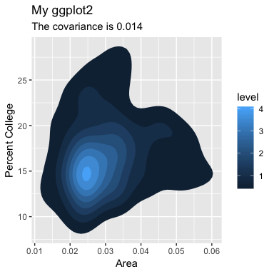

### Announcements

Homework submission guidelines
Submitting R code: 

- Use Rmarkdown and all working directories should be set to "./" if there are input datasets

- Submit your .Rmd script and compiled pdf. There will be penalties for scripts that fail to compile. (except errors related to missing dependencies - e.g. packages not installed on my computer, just make sure to mention which packages have been called).

--------------------------------------------------------------------------------------

### 1. Visualization 101

#### plot() 

- plot() generates a X-Y plot

- The basic syntax is plot(x-axis, y-axis)

- You can add more information to the plot with axis labels and titles.

```{r ,fig.width = 4,fig.height = 4,fig.align='center' }
x <- seq(-5, 5, by = 0.5) 
y <- x - 3
plot(x, y, 
     xlab = "X axis label here", 
     ylab = "Y axis label here", 
     main = "Plot Title here")
```

- We just used base R plotting

- base R is good for simple plots, but becomes complicated and ugly for any more advanced examples

- the popular alternative to base R is ggplot2 (we talked about this last week)

- ggplot2 is based on a grammer of graphics that makes plotting very modular

- let's try to remake the sample plot as before in ggplot

```{r ,fig.width = 4,fig.height = 4,fig.align='center' }
library(ggplot2)
x <- seq(-5, 5, by = 0.5) 
y <- x - 3
df <- data.frame(x,y)
ggplot(df,aes(x,y))+geom_point()
#ggplot(dataFrame,aesthetics(column header for x-axis, column header for y-axis))+plotting_style()
```

- How can I found out how to include axis labels?

- An amazing reference is https://ggplot2.tidyverse.org

- A broad overview on everything ggplot2 can do is https://www.rstudio.com/wp-content/uploads/2015/03/ggplot2-cheatsheet.pdf

- Plotting is a great means for displaying and investigating distributions


```{r ,fig.width = 4,fig.height = 4,fig.align='center' }
ggplot(df,aes(x))+geom_histogram()+
  labs(x="quantile",y="count",title="Our normal distribution")
```

- looks like a normal distribution!

- rnorm produces 1000 random values drawn from a normal distribution

- this is akin to measuring the heights of 1000 people with mean height 0 and sd height 1

- R brings up an important point, the binwidth greatly changes how a histogram will look

```{r ,fig.width = 4,fig.height = 4,fig.align='center' }
ggplot(df,aes(x))+geom_histogram(bins=3)+
  labs(x="quantile",y="count",title="3 Bins")

ggplot(df,aes(x))+geom_histogram(bins=5)+
  labs(x="quantile",y="count",title="5 Bins")

ggplot(df,aes(x))+geom_histogram(bins=300)+
  labs(x="quantile",y="count",title="300 Bins")
```

- There are other ways to display the data

- We can convert the count to a density, which normalizes the counts

```{r ,fig.width = 4,fig.height = 4,fig.align='center' }
x <- rnorm(1000, mean = 0,sd = 1)
ggplot(df,aes(x))+geom_density()
```

- QUESTION 1!?
  **How can I make the density plot above filled in with purple**

- What if we want to include both plots on the same screen, easy!

- Just add both geom's

```{r ,fig.width = 4,fig.height = 4,fig.align='center' }
ggplot(df,aes(x))+
  geom_histogram(aes(y=stat(density)),bins=30)+
  geom_density(color="red")+
  labs(x="quantile",y="density",title="Double Plots")
```

- Pulling random points from a distribution isn't the only, or likely best way to investigate a distribution

- Each distribution has functions called r(random), d(density), p(cumulative), q(quantile)

- Let's start with density as we have already been looking at it

```{r}
dnorm(0,mean = 0,sd = 1)
dnorm(2,mean = 0,sd = 1)
dnorm(-1,mean = 0,sd = 1)
```

- Let's plot it!
```{r ,fig.width = 4,fig.height = 4,fig.align='center' }
df <- data.frame(x=seq(-3,3,0.1),d=dnorm(seq(-3,3,0.1)))
ggplot(df,aes(x,d))+geom_point()
```

- Next, let's take a look at the cumulative distribution

```{r}
pnorm(0,mean = 0,sd = 1)
pnorm(2,mean = 0,sd = 1)
pnorm(-1,mean = 0,sd = 1)
```

- Let's plot this too!

```{r ,fig.width = 4,fig.height = 4,fig.align='center' }
df$p <- pnorm(df$x)
ggplot(df)+geom_point(aes(x,d),color="red")+geom_point(aes(x,p),color="blue")
```

- QUESTION 2 !?
  **How can I include a legend with this plot**

- The cumulative distribution logically reaches 0.5 just above the peak of the density

- Lastly we have q, which converts a cumulative density back into the quantile it came from

```{r}
qnorm(0.5,mean = 0,sd = 1)
qnorm(pnorm(0.5),mean = 0,sd = 1)
```

- The "rules" for d,c,r,p also work for every other distribution, although the parameters will change

- For example there is the binomial distribution, which indicates the number of successes in a number of trials

```{r}
rbinom(n=1,size = 10,prob = 0.3)
dbinom(4,size=10,prob=0.5)
getwd()
```

- Let's make a plot comparing the densities of the binomial and normal distributions

```{r ,fig.width = 4,fig.height = 4,fig.align='center' }
normVals <- dnorm(seq(-3,3,length.out = 100),mean=0,sd=1)
binomVals <- dbinom(1:100,size=100,prob=0.5)

#standard the values to min of 0 and max of 1
normVals <- (normVals-min(normVals))/(max(normVals)-min(normVals))
binomVals <- (binomVals-min(binomVals))/(max(binomVals)-min(binomVals))

df <- data.frame(xNorm=seq(-3,3,length.out = 100),normVals,xBinom=1:100,binomVals)

ggplot(df)+geom_line(aes(xNorm,normVals),color="red")+geom_point(aes(xNorm,binomVals),color="blue")+
  labs(x="X-Value",y="Density")
```

- While the two distributions are similar, they are clearly not the same

- Exercise!!!
The midwest dataframe has some great data on various midwest counties.  Use the dataframe to make the plot below.  Note, the examples on the geom_density_2d page of the tidyverse website might be helpful.  Create a Rmarkdown document with your code that creates this plot.  Upload the html output to cms.

```{r pressure, echo=FALSE, fig.cap="The plot you should make", out.width = '100%'}

```

Advanced:

Compare population to area, highlight the top 5 most populous counties with text and color code each country by state, including a legend.  Again calculate the covariance.  But please note that you only have to answer the non-advanced problem for credit.

