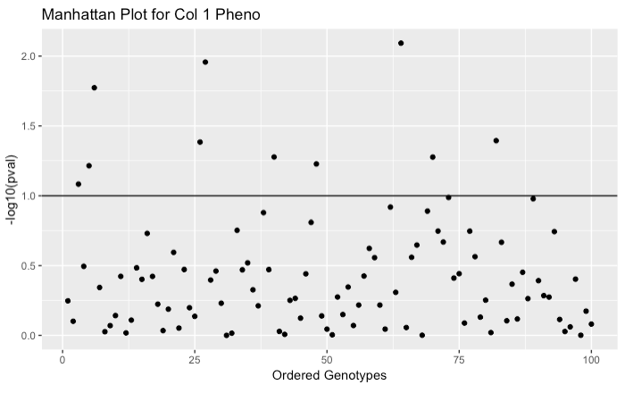
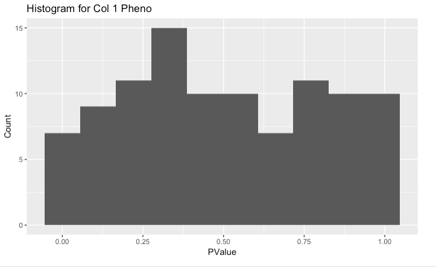

--------------------------------------------------------------------------


### 1.  Review: Handling Genotype Data 

- Last week we discussed reading in the genotypic data, fixing any flaws in the files, and then converting the ACGT's into numbers

- Really quickly let's just go over that process again

- First, read in the data forcing every column to be character, not Boolean

```{r, comment = NA, echo = FALSE, eval = TRUE}

# We can specify the column classes to character
geno_import <- read.csv("./genotype_data.csv", 
                      header = TRUE, 
                      stringsAsFactors = FALSE,
                      row.names = 1, colClasses = "character")
```


- Next we change the letters into two types of codes: either additive or dominant

$$X_a(A_1 A_1)=-1, X_a(A_1 A_2)=0, X_a(A_2 A_2)=1$$


$$X_d(A_1 A_1)=-1, X_d(A_1 A_2)=1, X_d(A_2 A_2)=-1$$

- When making these conversion remember that a pair of columns refers to a single allele or base within the genome, and that you must determine the minor allele to know which base is A1 or A2

- Here is a general function I wrote that gets the job done:

```{r}
genotype_coder <- function(geno_import, maf_limit){
  geno_input = mapply(c,geno_import[,seq(1,ncol(geno_import),2)], geno_import[,seq(2,ncol(geno_import),2)])
  
  xa_converter <- function(geno_col, numSamples, maf_limit){
    geno_count <- table(geno_col)
    if(min(geno_count)/length(geno_col) <= maf_limit){
      return(rep(3,numSamples))
    }
    minor_allele <- names(geno_count[geno_count == min(geno_count)])
    xa <- (geno_col[1:numSamples]==minor_allele) + (geno_col[(numSamples+1):length(geno_col)]==minor_allele)
    xa <- xa-1
    return(xa)
  }
  
  xa_mat  <- apply(geno_input, 2, xa_converter, nrow(geno_import), 0.05)
  xa_mat <- xa_mat[,xa_mat[1,]!=3]
  xd_mat <- 1 - 2*abs(xa_mat)
  
  return(list(xa_mat,xd_mat))
}
```

```{r}
  codes <- genotype_coder(geno_import, 0)
  xa_mat <- codes[[1]]
  xd_mat <- codes[[2]]
  xa_mat[1:10,1:10]
```


- Now that we have Xa and Xd codings for genotypes we can test their association with phenotypes.

- In this example we are going to use two continuous phenotypes. 

```{r, comment = NA, echo = TRUE}
sim_pheno_mx <- read.csv("./phenotype_data.csv", 
                     header = TRUE, row.names = 1)
head(sim_pheno_mx)
```

- Let's go through an example with one variant

```{r}
xa_input <- xa_mat[,1]
xd_input <- xd_mat[,1]
pheno_input <- sim_pheno_mx[,1]
n_samples <- length(xa_input)
```

- Following the notes we will contruct an equation of the form
$$y = X\beta + \epsilon   $$

```{r}
y <- pheno_input
x <- cbind(rep(1,length(xa_input)), xa_input, xd_input)
```

- Now we simply use the MLE equation

$$MLE(\hat{\beta}) = (x^Tx)^{-1}x^Ty$$

```{r}
library(MASS)
MLE_beta <- ginv(t(x) %*% x) %*% t(x) %*% y
```

- We now carry out the LRT recipte, which begins by getting the estimated phenotypes back with:

$$ \hat{y_i} = \hat{\beta_\mu} + x_{i,a}\hat{\beta_a} + x_{i,d}\hat{\beta_d} $$
$$ \hat{y} = x MLE(\hat{\beta}) $$
```{r}
y_hat <- x %*% MLE_beta
```

- Continuing with SSM and SSE
$$ SSM = \sum^{n}_{i=1} (\hat{y_i}-\bar{y})^2 $$
$$ SSE = \sum^{n}_{i=1} (y_i-\hat{y_i})^2 $$

```{r}
 SSM <- sum((y_hat - mean(y))^2)
 SSE <- sum((y - y_hat)^2)
```

- To get to the MSM and MSE we need to know the degrees of freedom

- df(M) is 3 (number of betas) - 1 = 2

- df(E) is the sample size - 3, again for each of the betas

- Forming the MSM and MSE is then simply division

```{r}
df_M <- 2
df_E <- n_samples - 3 
  
MSM <- SSM / df_M
MSE <- SSE / df_E
```

- The F-Statistics just the division of MSM and MSE

- To get the pval we use the cumulative distribution, just like we did for the normal pvals

```{r}
Fstatistic <- MSM / MSE
pval <- pf(Fstatistic, df_M, df_E,lower.tail = FALSE)
pval
```

- Now, let's wrap this all up in one function

```{r}
pval_calculator <- function(pheno_input, xa_input, xd_input){
    n_samples <- length(xa_input)
    X_mx <- cbind(1,xa_input,xd_input)
    
    MLE_beta <- ginv(t(X_mx) %*% X_mx) %*% t(X_mx) %*% pheno_input
    y_hat <- X_mx %*% MLE_beta
  
    SSM <- sum((y_hat - mean(pheno_input))^2)
    SSE <- sum((pheno_input - y_hat)^2)
  
    df_M <- 2
    df_E <- n_samples - 3 
  
    MSM <- SSM / df_M
    MSE <- SSE / df_E
  
    Fstatistic <- MSM / MSE
  
    # to check if it is correct 
    pval <- pf(Fstatistic, df_M, df_E,lower.tail = FALSE)
    return(pval)
}

pval_mx <- rep(0,nrow(xa_mat))
for(i in 1:nrow(xa_mat)){
  pval_mx[i] <- pval_calculator(sim_pheno_mx[,1], xa_mat[,i], xd_mat[,i])
}

pval_mx
```


*Exercise*

Using the p-values calculated above to create the following plots.  You may notice there is a horizontal bar in the manhattan plot, this bar represents the "cut-off".  The genotypes above the line are considered significant, and those below are insignificant.  What would be a reasonable cut-off line?  Once the reasonable cut off is set count how many genotypes are significant.


```{r, echo=FALSE, out.width = '100%'}

```


```{r, echo=FALSE, out.width = '100%'}

```


