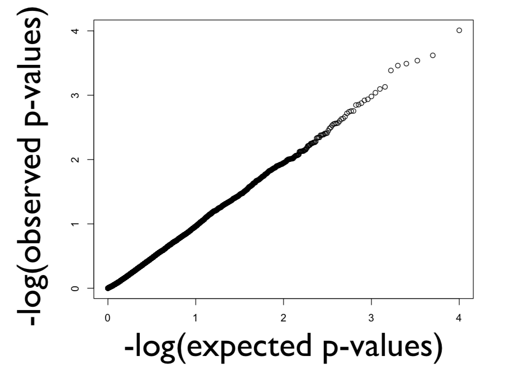
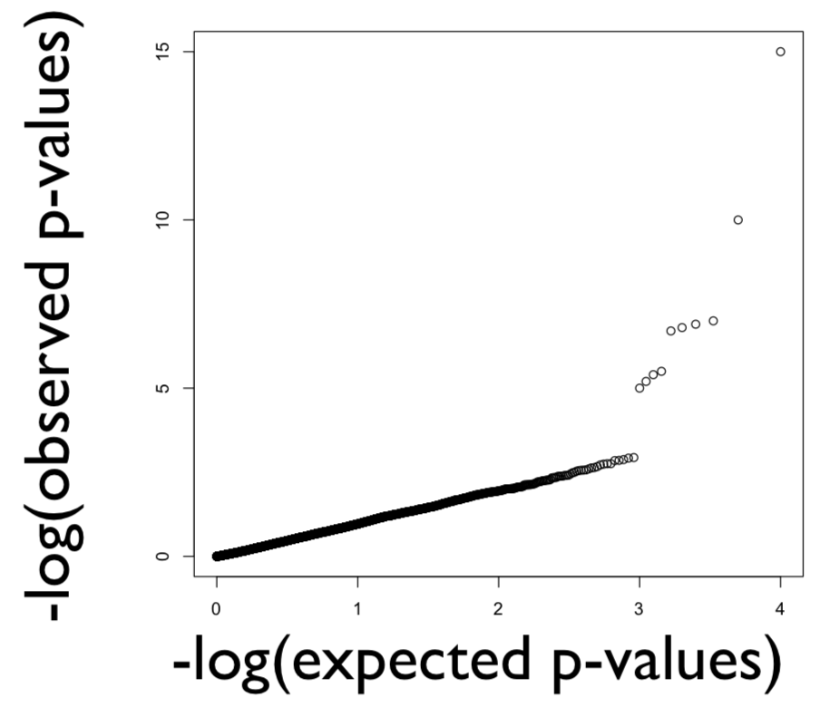
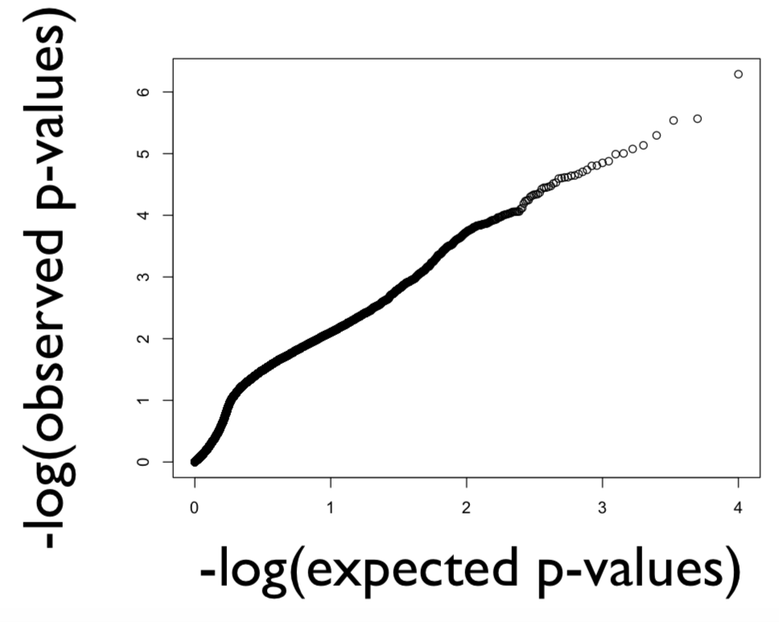
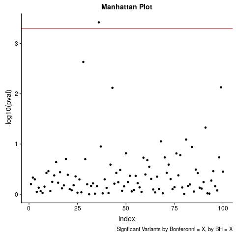
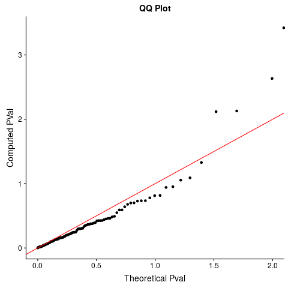
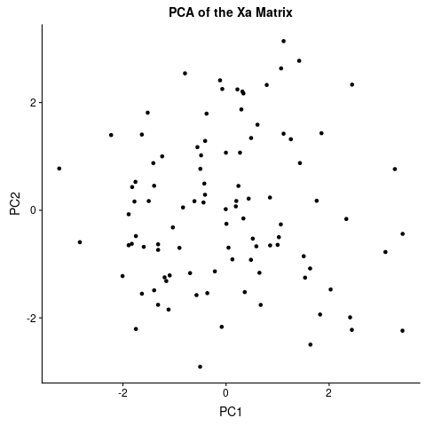

--------------------------------------------------------------------------


### 0.  Review: Basic GWAS

- Last week we discussed reading in the genotypic data, converting the ACGT's into Xa and Xd codings, then for each variant calculating the maximum likelihood beta values, f-statistics and ultimately p-value

- Today's material will build on how to analyze the results of this GWAS, and how to add further refinements that ensure the p-value represents the variant's relation to the trait and not anything else

- The next two chunks of code are a condensed version of everything we have done last week, the first chunk make the Xa and Xd codings

```{r, comment = NA, echo = FALSE, eval = TRUE}
#more detail for everything here can be found in lab 6

# We can specify the column classes to character
geno_import <- read.csv("./genotype_data.csv", 
                      header = TRUE, 
                      stringsAsFactors = FALSE,
                      row.names = 1, colClasses = "character")

genotype_coder <- function(geno_import, maf_limit){
  geno_input = mapply(c,geno_import[,seq(1,ncol(geno_import),2)], geno_import[,seq(2,ncol(geno_import),2)])
  
  xa_converter <- function(geno_col, numSamples, maf_limit){
    geno_count <- table(geno_col)
    if(min(geno_count)/length(geno_col) <= maf_limit){
      return(rep(3,numSamples))
    }
    minor_allele <- names(geno_count[geno_count == min(geno_count)])
    xa <- (geno_col[1:numSamples]==minor_allele) + (geno_col[(numSamples+1):length(geno_col)]==minor_allele)
    xa <- xa-1
    return(xa)
  }
  
  xa_mat  <- apply(geno_input, 2, xa_converter, nrow(geno_import), 0.05)
  xa_mat <- xa_mat[,xa_mat[1,]!=3]
  xd_mat <- 1 - 2*abs(xa_mat)
  
  return(list(xa_mat,xd_mat))
}

  codes <- genotype_coder(geno_import, 0)
  xa_mat <- codes[[1]]
  xd_mat <- codes[[2]]
```


- This second chunk will actually complete the GWAS

```{r, comment = NA, echo = TRUE}
library(MASS)
#more detail for everything here can be found in lab 7

sim_pheno_mx <- read.csv("./phenotype_data.csv", 
                     header = TRUE, row.names = 1)


pval_calculator <- function(pheno_input, xa_input, xd_input){
    n_samples <- length(xa_input)
    X_mx <- cbind(1,xa_input,xd_input)
    
    MLE_beta <- ginv(t(X_mx) %*% X_mx) %*% t(X_mx) %*% pheno_input
    y_hat <- X_mx %*% MLE_beta
  
    SSM <- sum((y_hat - mean(pheno_input))^2)
    SSE <- sum((pheno_input - y_hat)^2)
  
    df_M <- 2
    df_E <- n_samples - 3 
  
    MSM <- SSM / df_M
    MSE <- SSE / df_E
  
    Fstatistic <- MSM / MSE
  
    pval <- pf(Fstatistic, df_M, df_E,lower.tail = FALSE)
    return(pval)
}

pval_ph1 <- rep(0,nrow(xa_mat))
pval_ph2 <- rep(0,nrow(xa_mat))
for(i in 1:nrow(xa_mat)){
  pval_ph1[i] <- pval_calculator(sim_pheno_mx[,1], xa_mat[,i], xd_mat[,i])
  pval_ph2[i] <- pval_calculator(sim_pheno_mx[,2], xa_mat[,i], xd_mat[,i])
}
```


- A vector of p-values is hard to interpret, so instead last week we went through the creation  of a Manhattan plot

```{r}
library(ggplot2)
#because we are using ggplot we need to form a data frame
 manhattanDf <- data.frame(index=1:length(pval_ph1),pval1=pval_ph1,pval2=pval_ph2)
 
 #remember that manhattan plots do not plot just the pval but the -log10(pval)
ggplot(manhattanDf,aes(index,-log10(pval1)))+geom_point()+labs(title="First Column Phenotypes")
ggplot(manhattanDf,aes(index,-log10(pval2)))+geom_point()+labs(title="Second Column Phenotypes")
```

## 1.  QQ-Plots

- Two big questions we can ask ourselves are:
    1 - which of these variants biologically relates to the phenotype I am testing
    2 - Are there any other trends in the data that could be corrupting the direct comparison between the genotype and phenotype

- Luckily for us, both of these questions can be answered with one plot, the QQ-plot

- As the name indicates, the QQ-plot compares the quantiles of an achieved distribution to the quantiles of a theorized distribution.  This can be helpful for example if you measured a bunch of people in a population and you think the heights are distributed normally but you aren't sure

(Reminder: a quantile is simply the measure that will cut off a certain proportion of the population)

```{r}
qnorm(0.025)
qnorm(0.5)
qnorm(1)
```

- Let's run through a really basic plot following that example.  First we will simulate measuring one hundred heights

```{r}
heights <- rnorm(100, mean=5.5, sd = 0.5)

#when forming the quantiles we need two extra values for the -Inf and Inf on either end of the quantile range
normalQuantiles <- qnorm(seq(0,1,length.out = (length(heights)+2)), mean = 5.5, sd = 0.5) 
#then we remove the -Inf and Inf values
normalQuantiles <- normalQuantiles[2:(length(heights)+1)]
#the values have to be sorted so that each measured heights finds its corresponding theoretical quantile
qqDf <- data.frame(heights=sort(heights), normalQuantiles=sort(normalQuantiles))
ggplot(qqDf, aes(heights, normalQuantiles)) + geom_point() + geom_abline(intercept = 0, slope = 1, color="red")
```

- The quantiles genrally form a straight line, meaning that each theoretical quantile matches the actual value.  Since the theory is that the data is normally distributed, we can draw the conclusion that the measured data is normally distributed

- We can try this again, but we will assume that tall people get an extra boost in height that is exponentially proportional to their original height

```{r}
heights <- rnorm(100, mean=5.5, sd = 0.5)
heights[heights > mean(heights)] <- heights[heights > mean(heights)]+(0.01*heights[heights > mean(heights)]^2)

#when forming the quantiles we need two extra values for the -Inf and Inf on either end of the quantile range
normalQuantiles <- qnorm(seq(0,1,length.out = (length(heights)+2)), mean = 5.5, sd = 0.5) 
#then we remove the -Inf and Inf values
normalQuantiles <- normalQuantiles[2:(length(heights)+1)]
#the values have to be sorted so that each measured heights finds its corresponding theoretical quantile
qqDf <- data.frame(heights=sort(heights), normalQuantiles=sort(normalQuantiles))
ggplot(qqDf, aes(heights, normalQuantiles)) + geom_point() + geom_abline(intercept = 0, slope = 1, color="red")
```

- Here we see a large departure from the line, indicating that our data is not normally distributed and therefore something is wrong with our assumption with the data

- This ability to determine when our underlying data does not follow assumption can be used in our GWAS

- Remembering that the distribution of p-values assuming that the null hypothesis is correct will follow an uniform distribution we can for a QQ plot for GWAS following the below steps

How to construct a QQ plot for GWAS:

  1. If you performed N tests, take the -log (base 10) of each of the p-values and put them in rank order from smallest to largest

  2. Create a vector of N values evenly spaced from 0 to 1 spaced out by $\frac{1}{N}$  (how do we do this?), take the -log of each of these values and rank them from smallest to largest

  3. Plot these two vectors, the one compared against the other

\vspace{20pt}

**POSSIBLE OUTCOME (A):** In an ideal GWAS case where there ARE NO causal polymorphisms, you QQ will look like the figure below. The reason is that we will observe a uniform distribution of p-values from such a case in our QQ we are plotting this observed distribution of p-value versus the expected distribution of p-values: a unifrom distribution (where both have been -log transformed). Note that if your GWAS analysis is correct but you do not have enough power to detect positions of causal polymorphisms, this will also be your result, i.e. it is a way to assess whether you can detect any hits in your GWAS.


```{r, echo=FALSE, out.width = '100%'}

```


\vspace{20pt}


**POSSIBLE OUTCOME (B):** In an ideal GWAS case where there ARE causal polymorphisms, your QQ plot will be a line with a tail like the figure below. This happens because most of the p-values observed follow a uniform distribution (i.e. they are not in LD with a causal polymorphism so the null hypothesis is correct!) but the few that are in LD with a causal polymorphism will produce significant p-values (extremely low = extremely high -log(p-values)) and these are in the "tail." This is how we want our QQ-plot to look.


 \center {width=250px} \center
```{r, echo=FALSE, out.width = '100%'}

```


\vspace{20pt}

**POSSIBLE OUTCOME (C):** In practice, you can find your QQ plot looks different than either the "null GWAS" case or the "ideal GWAS" case. This indicates that something is wrong, and, if this is the case, you should not interpret any of your significant p-values as indicating locations of causal polymorphisms. Note that this means that you need to find an analysis strategy such that the result of your GWAS produes a QQ plot that does NOT look like this (note that this takes experience and many tools to do consistently!). Also note that unaccounted for covariates can cause this issue and the most frequent culprit is unaccounted for population structure.


```{r, echo=FALSE, out.width = '100%'}

```


\vspace{20pt}

## 2. Multiple Testing


Some fun: https://xkcd.com/882/

- While the QQ-plot is a graphical way to determine whether, and which, variants in your GWAS are significant it does not provide any clear dividing line between variants that you should check out (call them significant) and variants that mean nothing to your study (call them insignificant)

- Previously we have used the 0.05 alpha value as the pval cut-off to make this distinction.  However, this can become a problem for many tests especially in a large GWAS.

- Let's show how by simulting a typical GWAS with 6,000,000 variants. In this simulation none of the variants will actually be significant i.e. they will all be pulled from the null hypothesis causing the pval distribution to be uniform.

- While the manhattan plot does not look very interesting

```{r}
gwasPvals <- runif(12000000,min = 0,max = 1)
manhattanDf <- data.frame(index=1:length(gwasPvals),pvals=gwasPvals)
manhattanDf <- manhattanDf[manhattanDf$pvals < 0.01,]
ggplot(manhattanDf,aes(index,-log10(pvals)))+geom_point()+labs(title="First Column Phenotypes")
```

- Checking how many variants are less than the alpha value of 0.05 we get a startling number of results

```{r}
print(paste("The total pvals that are significant =", sum(gwasPvals<0.05)))
```

- We can solve this problem using multiple hypothesis corrections.  There are two major corrections used:
 1 - Bonferonni - The most conservative and oldest correct.  The pvals are multiplied by the number of tests conducted.
 2 - Benjamini-Hochberg - Aims to control the number of false discoveries among the rejected hypotheses
 
- The best way to form the multiple hypothesis test is using the p.adjust function

```{r}
bonfPvals <- p.adjust(gwasPvals,method = "bonferroni")
bhPvals <- p.adjust(gwasPvals,method = "BH")
ourBonfPvals <- gwasPvals*length(gwasPvals)
ourBonfPvals[ourBonfPvals > 1] = 1

unique(bonfPvals)
unique(ourBonfPvals)
```

```{r}
print(paste("The total pvals that are significant =", sum(gwasPvals<0.05)))
print(paste("The total pvals that are significant =", sum(bonfPvals<0.05)))
print(paste("The total pvals that are significant =", sum(bhPvals<0.05)))
```

- Note that while the same multiple hypothesis testing correcting can be applied by changing the alpha value for the bonferonni correction, this cannot be done for the benjammini hochberg

- But what if there are 3 variants that are significant

```{r}
gwasPvals[sample(1:length(gwasPvals),3)]=runif(3,min = 10^-10,max = 10^-6)

bonfPvals <- p.adjust(gwasPvals,method = "bonferroni")
bhPvals <- p.adjust(gwasPvals,method = "BH")

print(paste("The total pvals that are significant =", sum(bonfPvals<0.05)))
print(paste("The total pvals that are significant =", sum(bhPvals<0.05)))

```


- Bonferonni will begin to accept nothing despite the fact that many of the variants may be significant

- To get past this problem the GWAS community has agreed that the cut-off is 5*10^-8, although there is still some debate (https://www.nature.com/articles/ejhg2015269, https://academic.oup.com/ije/article/41/1/273/647338)


### 3.  Principal Components Analysis

- Principal components analysis is very important for genetic analysis for two reasons:
 1. The measured data is often very high dimensional (meaning there are thousands of SNPs measured, or genes measured for their expression).  Visualizing this data is impossible as we only see in 3-dimensions.  PCA lets us condense the dimensionality.
 2. Ancestry or population structure is a large and sometimes overwheling cause for why genetic data looks the way it does.  If we are testing whether SNP A causes trait X, we want to make sure that the p-value reflects SNP A, not the habits of the people that contain SNP A.  To factor out this population structure trend we must first measure it - for this task we use PCA.
 
 - Disclaimer: A full explanation of PCA requires a good understanding of linear algebra, which is slightly beyond the scope of the class and definitely beyond our time limits.  For a good tutorial see http://arxiv.org/pdf/1404.1100.pdf , although there are many, many other articles you can find as well.
 
 - The simpleset explanation of a PCA is that it is a process the finds the axes of greatest variation within your data and projects the data onto these axes
 
 - Let's walk through an example using the iris data set
 
  
```{r}
ggplot(iris,aes(Petal.Length,Petal.Width))+geom_point()
```

- We calculate the principal components using the prcomp function

```{r}
pca.result <- prcomp(iris[,3:4])
str(pca.result)
```

```{r}
#$sdev contains information about the fraction of variation explained by a certain principal component.
pca.result$sdev
(pca.result$sdev / sum(pca.result$sdev))*100
summary(pca.result)

```

What is shown here is the percentage of variance explained by each principal component. This means that the first PC explains ~99% of the variation in the data, and the second component explains about 1% of the variation and so on. 

The second piece of information is the rotation, which tells us the actual new axes of greatest rotation

```{r}
#$rotation contains the directions of principal components in each of its columns.
pca.result$rotation
ggplot(iris,aes(Petal.Length,Petal.Width))+geom_point()+
  geom_segment(x=4,y=1.5,
               xend=pca.result$rotation[1,2]+4,
               yend=pca.result$rotation[2,2]+1.5, color="blue")+
geom_segment(x=4,y=1.5,
               xend=pca.result$rotation[1,1]+4,
               yend=pca.result$rotation[2,1]+1.5,color="red")
```
 
- The remaining data structures are as follows

```{r}
#$center contains the mean for each data column (in our case it would be close or equal to 0 since we centered the data). 
pca.result$center

#$scale contains information about whether or not we gave the option to scale (divide it by its standard deviation) the data. 
pca.result$scale

#$x contains the coordinate values of the data projected to a principal component in each of its columns.
pcaDf <- data.frame(pc1=pca.result$x[,1], pc2=pca.result$x[,2])
ggplot(pcaDf,aes(pc1,pc2))+geom_point()
```


```{r}
colnames(iris)
```


- While the 2D example is nice, it does not really provide any motivation of why we would use PCA

- Here is a quick 3D example, see how the virginica and versicolor flowers are well combined in the 3d plot but by finding the axes of greatest variation we are able to separate the two groups
 
 
```{r}
library("gg3D")
data(iris)
ggplot(iris, aes(x=Sepal.Length, y=Sepal.Width, z=Petal.Width, color=Species)) + 
  theme_void() + axes_3D() + stat_3D()

pca.result <- prcomp(iris[,c(1,2,4)])
pcaDf <- data.frame(pc1=pca.result$x[,1], pc2=pca.result$x[,2], species=iris$Species)
ggplot(pcaDf,aes(pc1,pc2))+geom_point(aes(color=species))
```


** Exercises **

You have hopefully seen the importance of the Manhattan plot with multiple hypothesis correction, QQ-plot, and the PCA.  To test your understanding make each plot for the GWAS of the second phenotype.  The output plots should look something like:

Hint: from the very beginning we have the pvals for the second phenotype saved to pval_ph2

```{r}
head(pval_ph2)
```


```{r, echo=FALSE, out.width = '100%'}

```

```{r, echo=FALSE, out.width = '100%'}

```


```{r, echo=FALSE, out.width = '100%'}

```


